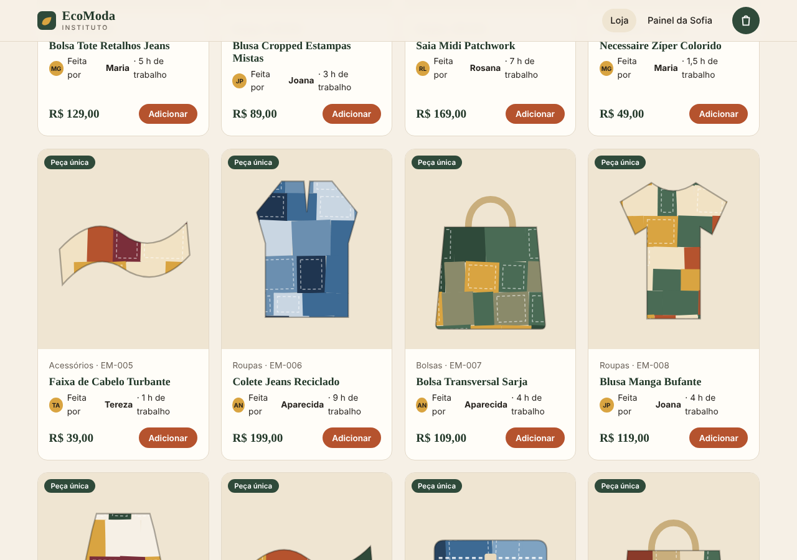
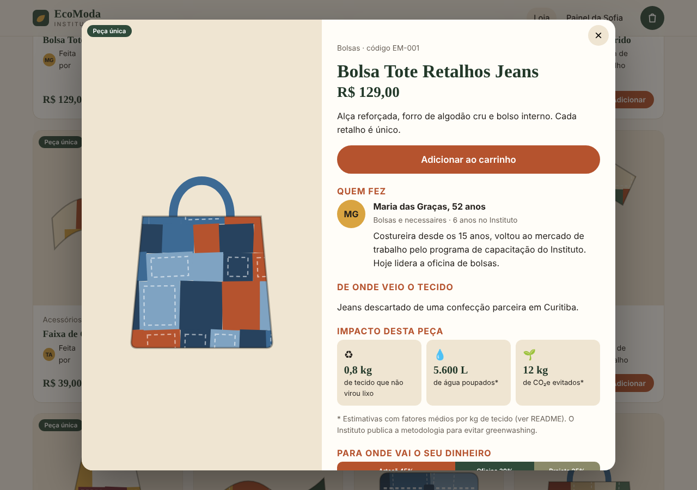
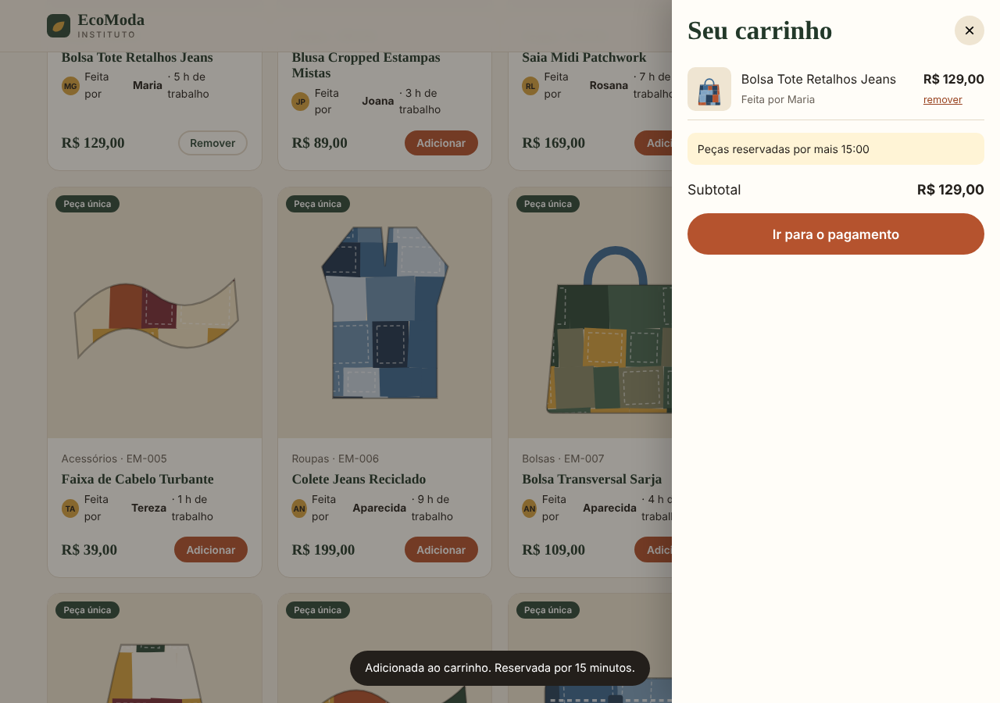
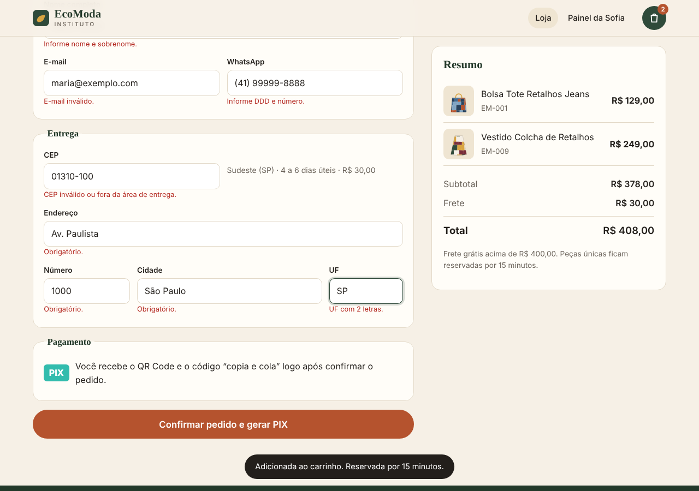
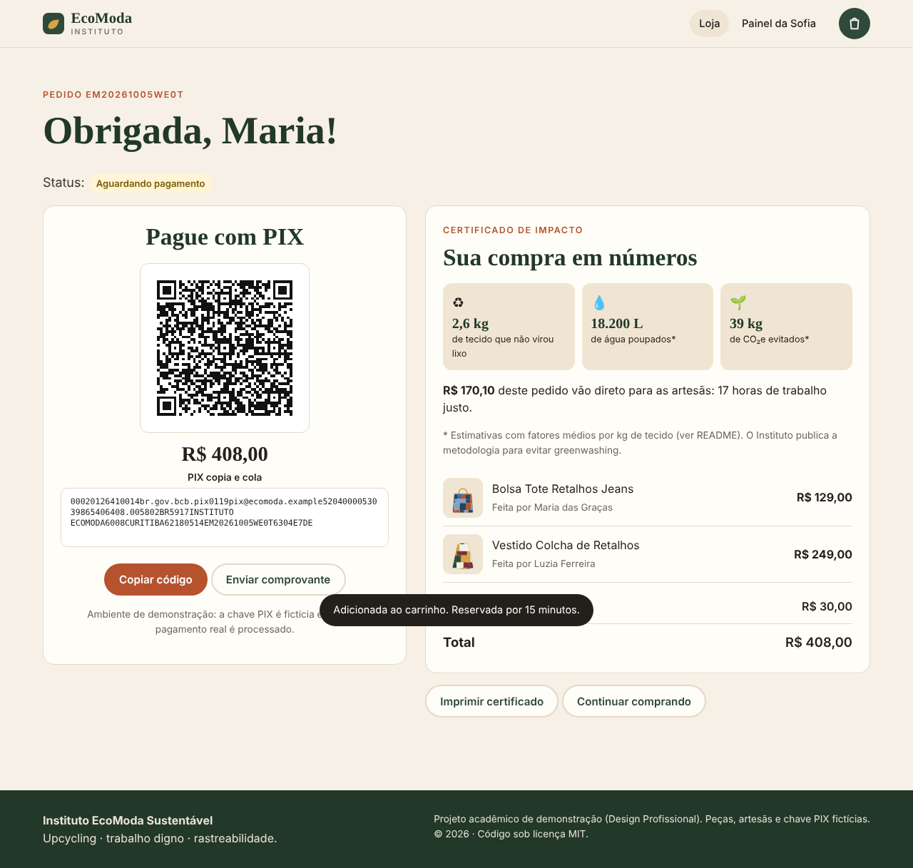
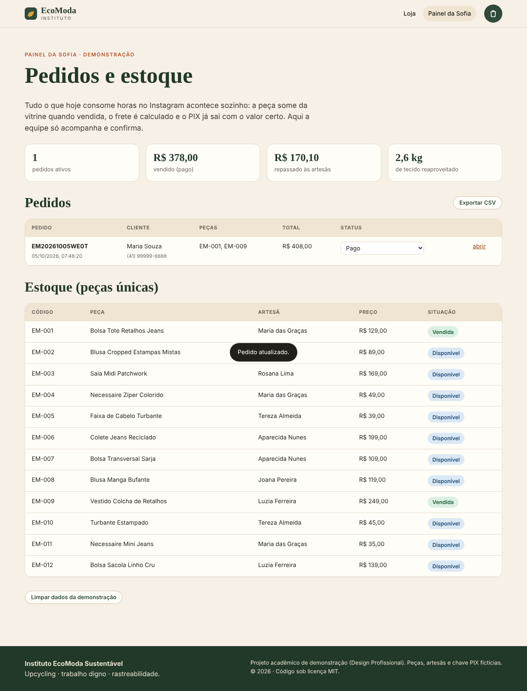
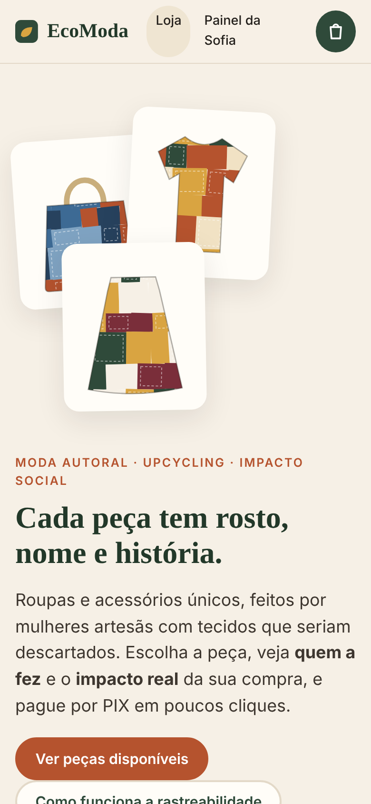
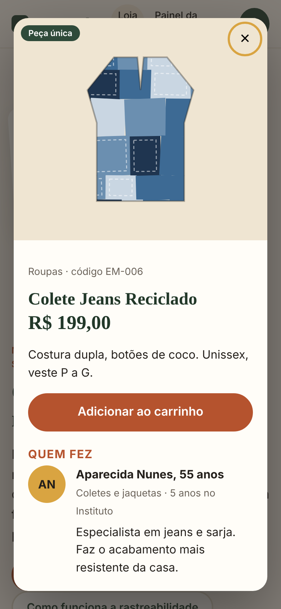
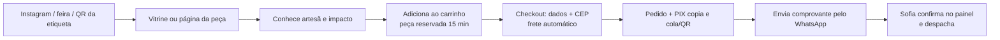
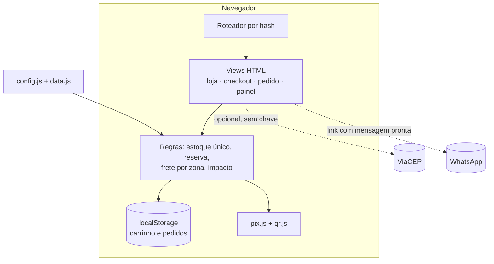

# 🌿 Instituto EcoModa Sustentável · Loja com rastreabilidade por peça

> Estudo de Caso 4 · Disciplina **Design Profissional** (Produção de Portfólio & Desenvolvimento Empresarial) · Prof. Sedenilso Antonio Machado
> Autor: **Eduardo Cavalli** · Entrega: 05/10/2026

**Demo publicada:** `https://eduardocavalli85.github.io/ecomoda-instituto/` *

Web app de e-commerce para peças únicas de upcycling. Cada peça mostra **quem a fez**, **de onde veio o tecido** e **o impacto ecológico e social da compra**. Carrinho, frete por CEP e pagamento por PIX funcionam sem intervenção manual.


## 1. Briefing do problema

O **Instituto EcoModa** é uma ONG e marca autoral de moda sustentável, gerida por Sofia Andrade. Faz upcycling de tecidos e emprega mulheres em situação de vulnerabilidade social (10 artesãs e 2 assistentes administrativas, sem sócios, com conselho voluntário).

| Situação | Detalhe |
|---|---|
| **Hoje** | Vendas em feiras, eventos e show-room. Online, só por encomendas no Instagram e mensagens privadas. |
| **Dor** | A equipe gasta horas respondendo se a peça única ainda existe, calculando frete na mão e enviando dados de PIX. Muitos compradores desistem no meio da conversa. |
| **Meta** | Alcançar público nacional para manter o projeto sustentável e pagar dignamente as artesãs. |
| **Ameaça** | Fast-fashion com coleções “verdes” e orçamentos enormes (*greenwashing*). |
| **Oportunidade** | Provar o impacto: o comprador sabe **qual artesã** fez a peça e **qual o impacto ecológico** da compra. |

### Como o app resolve cada dor

| Dor do cliente | Solução no app |
|---|---|
| “A peça ainda está disponível?” | Vitrine com **estoque de peça única**: ao comprar, a peça sai da vitrine; no carrinho ela fica **reservada por 15 min**. |
| Frete calculado manualmente | **Cálculo automático por CEP** (zona de entrega, prazo e valor, com frete grátis acima de R$ 400). |
| Envio de dados bancários por mensagem | **PIX “copia e cola” + QR Code** gerados com o valor exato e o código do pedido (BR Code padrão Banco Central). |
| Desistência no meio da conversa | Compra autônoma: escolher → carrinho → CEP → PIX, em poucos cliques e sem falar com ninguém. |
| Greenwashing dos concorrentes | **Página de rastreabilidade por peça**: artesã, origem do tecido, kg reaproveitados, água e CO₂ estimados, divisão do preço e **QR Code para a etiqueta física**. |
| Equipe pequena | **Painel da Sofia**: pedidos, status (pago/enviado/cancelado), estoque, KPIs de impacto e exportação CSV. |

---

## 2. Decisão de design: por que um *web app* (e não app nativo ou sistema)?

| Opção | Avaliação |
|---|---|
| App móvel nativo | Exige instalação, loja de apps e manutenção por plataforma. Mata a conversão de um comprador que chega por link do Instagram ou por QR da etiqueta. |
| Site institucional |  Conta a história, mas **não resolve** disponibilidade, frete e pagamento: voltaria o atendimento manual. |
| Sistema/dashboard interno |  Ajuda a Sofia, mas não atende o comprador. É só metade do problema. |
| **Web app (loja + painel)**  | O comprador entra por **link ou QR Code**, sem instalar nada, e fecha a compra sozinho. O mesmo código traz um **painel simples** para a equipe. Funciona no celular (a maioria dos acessos vindos do Instagram) e custa **R$ 0** para hospedar. |

**Princípios de projeto**

1. **Link como porta de entrada:** o QR Code costurado na peça abre `#/peca/EM-001`. A etiqueta vira marketing e prova de impacto.
2. **Mobile first:** layout testado em 390 px sem rolagem horizontal.
3. **Transparência verificável:** os fatores de impacto estão em `js/config.js`, documentados e marcados como estimativa. Número sem método é greenwashing.
4. **Zero custo e zero manutenção:** site estático, sem servidor, banco ou build. Uma ONG de 12 pessoas consegue manter.
5. **Acessibilidade:** HTML semântico, foco visível, `aria-label`s, `prefers-reduced-motion`, navegação por teclado, `<dialog>` nativo.

---

## 3. Protótipos / telas

| Vitrine | Peça + rastreabilidade | Carrinho com reserva |
|---|---|---|
|  |  |  |

| Checkout com frete por CEP | Pedido: PIX + certificado de impacto | Painel da Sofia |
|---|---|---|
|  |  |  |

| Mobile · home | Mobile · peça |
|---|---|
|  |  |

### Jornada do comprador



---

## 4. Arquitetura

**Front-end estático (HTML + CSS + JavaScript puro), sem framework, sem bundler e sem dependências de runtime.** Abre com duplo clique em `index.html` ou em qualquer hospedagem estática.

```
ecomoda-instituto/
├── index.html            # casca da aplicação (header, gaveta do carrinho, modal, rodapé)
├── css/styles.css        # design system (tokens CSS, componentes, responsivo, impressão)
├── js/
│   ├── config.js         # configuração PÚBLICA: loja, chave PIX fictícia, frete, fatores de impacto
│   ├── data.js           # dados de demonstração: artesãs e peças (fictícios)
│   ├── art.js            # ilustração procedural das peças em SVG (patchwork determinístico)
│   ├── pix.js            # BR Code PIX (EMV + CRC16/CCITT-FALSE)
│   ├── app.js            # estado, regras de negócio, views e roteador por hash
│   └── vendor/qr.js      # gerador de QR Code próprio (byte, ECC M, versões 1-20), MIT
├── docs/screens/         # capturas de tela usadas neste README
├── LICENSE               # MIT
└── README.md
```



| Decisão | Motivo |
|---|---|
| SPA com roteador por `hash` (`#/peca/EM-001`) | Funciona em GitHub Pages sem configuração de servidor e gera links compartilháveis para a etiqueta. |
| `localStorage` como persistência da demo | Mantém tudo gratuito e sem backend. **Limitação assumida:** pedidos ficam só no navegador de quem comprou (ver [Roadmap](#roadmap)). |
| PIX estático com BR Code próprio | Sem gateway, sem taxa e **sem credenciais**. Validado por CRC16. |
| QR Code próprio | Sem depender de CDN. Validado decodificando com OpenCV em vários tamanhos (de 21×21 a 77×77 módulos). |
| Ilustrações SVG procedurais | Cada peça tem visual único e leve, sem fotos nem direitos de imagem. Em produção, trocar por fotos reais. |
| Escape de HTML (`esc()`) em todo dado digitado | Evita XSS no painel. A exportação CSV neutraliza injeção de fórmula (`=`, `+`, `-`, `@`). |

---

## 5. Como executar

Requisitos: **qualquer navegador moderno**. Não precisa instalar nada.

```bash
git clone https://github.com/eduardocavalli85/ecomoda-instituto.git
cd ecomoda-instituto

# opção A: abrir direto
open index.html            # macOS  |  xdg-open index.html (Linux)  |  start index.html (Windows)

# opção B: servidor local (recomendado)
python3 -m http.server 8000      # depois acesse http://localhost:8000
# ou: npx serve .
```

**Roteiro de teste (2 minutos)**

1. Na vitrine, clique numa peça e veja **artesã, origem do tecido, impacto e QR da etiqueta**.
2. Adicione duas peças. O carrinho mostra o **cronômetro de reserva**.
3. Em *Ir para o pagamento*, preencha os dados e um CEP (ex.: `01310-100`). O **frete e o prazo** aparecem na hora.
4. Confirme: você recebe o **QR Code e o PIX copia e cola** (valor exato) e o **certificado de impacto**.
5. Volte à vitrine: as peças compradas aparecem como **Vendidas**.
6. Abra **Painel da Sofia**, mude o status do pedido e veja os KPIs. Use *Exportar CSV* se quiser.

### Publicação

GitHub Pages, sem build:
`Settings → Pages → Build and deployment → Source: Deploy from a branch → Branch: main, pasta / (root) → Save`.
Em ~1 minuto o site fica em `https://eduardocavalli85.github.io/ecomoda-instituto/`.

---

## 6. Segurança e credenciais

- ✅ **Nenhuma credencial, senha, token ou chave de API** no código nem no histórico de commits.
- A chave PIX em `js/config.js` é **fictícia** (`pix@ecomoda.example`). Chave PIX é um dado público de recebimento, não uma senha. Mesmo assim, o repositório de exemplo não usa a real.
- `.gitignore` bloqueia `.env*`, `*.pem`, `*.key`, `secrets.*`, `node_modules/`, `dist/` e `build/`.
- **Regra do projeto:** tudo em `js/config.js` vai para o navegador de qualquer visitante. Segredos reais (API de frete, gateway de pagamento, banco de dados) ficam **em variáveis de ambiente de um backend**, nunca no front-end.
- O painel desta demonstração **não tem autenticação** (os dados estão só no navegador). Em produção é obrigatório proteger com login (ver Roadmap).

---

## 7. Premissas e limitações (transparência)

- **Dados fictícios:** artesãs, peças, preços e a chave PIX são inventados para demonstração. Qualquer semelhança com pessoas reais é coincidência.
- **Impacto ecológico:** usa fatores *ilustrativos* (`7.000 L de água` e `15 kg CO₂e` por kg de tecido novo evitado). O Instituto deve validá-los com literatura/fornecedores e publicar a fonte antes de divulgar.
- **Frete:** tabela por região do CEP, a partir de Curitiba. Em produção, trocar por API (Correios/Melhor Envio) chamada por um backend.
- **PIX:** gera o código de cobrança, mas **a confirmação do pagamento é manual** (a Sofia confere o comprovante e marca como pago).
- **Estoque/pedidos** vivem no `localStorage` do navegador: a baixa de estoque só vale para quem usa aquele navegador.

## Roadmap

1. Backend gerenciado (Supabase ou Firebase) para estoque e pedidos compartilhados, com **login da equipe** e regras de segurança por linha.
2. Webhook de PSP (Pix com confirmação automática) e cálculo de frete real por API.
3. Cadastro de peças pelo painel, com upload de fotos e geração da etiqueta (QR) em PDF.
4. Medição de impacto com dados reais e selo de auditoria externa.
5. Testes automatizados (Playwright) e deploy contínuo.

---

## 8. Critérios do enunciado → onde está no projeto

| Critério | Evidência |
|---|---|
| Resolução da dor + decisão de design + protótipo | Seções 1, 2 e 3; app funcionando em `index.html` |
| Nome do projeto com o nome da empresa | Repositório `ecomoda-instituto` |
| `.gitignore` adequado | [`.gitignore`](.gitignore) |
| `LICENSE` | [`LICENSE`](LICENSE) (MIT) |
| Sem credenciais | Seção 6 |
| README: briefing, justificativa, protótipos, arquitetura, execução | Seções 1 a 5 |

## Licença

Distribuído sob a licença **MIT**. Veja [`LICENSE`](LICENSE).
